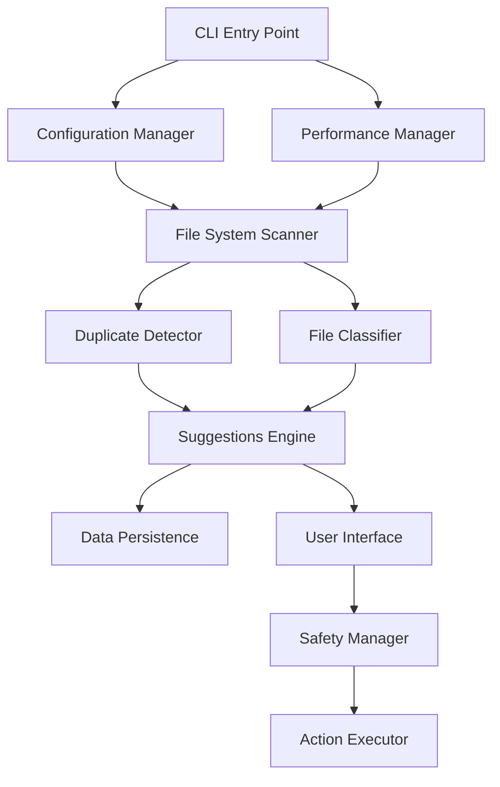

# Module Analysis & Architecture Design

## High-Level Architecture

## Proposed Module Breakdown

### 1. Configuration Manager
**Purpose**: Handle all configuration loading, validation, and management
**Responsibilities**:
- Load YAML/JSON configuration files
- Validate configuration values
- Provide default configurations
- Handle configuration file creation/updates
**Dependencies**: pathlib, yaml/json parsers
**Size Estimate**: Small (200-300 lines)
**LLM Friendliness**: ✅ High - self-contained, pure logic, easy to test

### 2. File System Scanner
**Purpose**: Traverse file systems and collect file metadata
**Responsibilities**:
- Recursive directory traversal with configurable depth
- File metadata collection (size, mtime, path)
- Exclusion rule processing
- Progress tracking integration
**Dependencies**: pathlib, os, scandir (for performance)
**Size Estimate**: Medium (400-600 lines)
**LLM Friendliness**: ✅ High - algorithmic, testable with mock filesystem

### 3. Duplicate Detector
**Purpose**: Identify duplicate files through content hashing
**Responsibilities**:
- Calculate file hashes (MD5/SHA256)
- Group files by hash
- Optimize for large files (chunked reading)
- Parallel hash computation
**Dependencies**: hashlib, concurrent.futures
**Size Estimate**: Medium (300-500 lines)
**LLM Friendliness**: ✅ High - algorithmic core, easy to mock file I/O

### 4. File Classifier
**Purpose**: Categorize files and generate cleanup suggestions
**Responsibilities**:
- Classify files by type and purpose
- Apply size and age thresholds
- Generate intelligent suggestions
- Calculate potential space savings
**Dependencies**: pathlib, mimetypes
**Size Estimate**: Medium (400-600 lines)
**LLM Friendliness**: ✅ High - rule-based logic, highly testable

### 5. Performance Manager
**Purpose**: Manage thread pools and system resource usage
**Responsibilities**:
- Dynamic thread pool sizing
- Resource monitoring (CPU, memory, I/O)
- Background/foreground mode handling
- Adaptive performance adjustment
**Dependencies**: psutil, concurrent.futures, threading
**Size Estimate**: Medium (300-500 lines)
**LLM Friendliness**: ⚠️ Medium - requires understanding of threading, but can be developed incrementally

### 6. User Interface
**Purpose**: Provide rich terminal interface and progress display
**Responsibilities**:
- Progress bars and status displays
- Interactive selection interfaces
- Color-coded output formatting
- Configuration of display preferences
**Dependencies**: rich
**Size Estimate**: Medium (400-600 lines)
**LLM Friendliness**: ✅ High - UI logic is straightforward, rich library handles complexity

### 7. Data Persistence
**Purpose**: Store and retrieve scan results and configuration
**Responsibilities**:
- SQLite database management
- Schema definition and migrations
- Historical scan data storage
- Query optimization for large datasets
**Dependencies**: sqlite3
**Size Estimate**: Medium (300-500 lines)
**LLM Friendliness**: ✅ High - standard database operations, easy to test

### 8. Safety Manager
**Purpose**: Ensure safe operations and provide recovery mechanisms
**Responsibilities**:
- Dry run mode implementation
- Backup integration
- Error handling and recovery
- Operation rollback support
**Dependencies**: shutil, winshell (for Recycle Bin)
**Size Estimate**: Medium (300-500 lines)
**LLM Friendliness**: ✅ High - rule-based safety checks, testable with mocks

## Module Coupling Analysis

### Low Coupling ✅
- **Configuration Manager**: Only provides config data, no dependencies on other modules
- **Data Persistence**: Clean interface for storing/retrieving data
- **User Interface**: Consumes data from other modules, doesn't modify state

### Medium Coupling ⚠️
- **File System Scanner**: Depends on Configuration Manager, used by multiple modules
- **Performance Manager**: Coordinates with multiple modules but has clear interfaces

### Benefits of This Modular Structure
1. **Independent Development**: Each module can be developed and tested separately
2. **Clear Interfaces**: Well-defined contracts between modules
3. **Testability**: Easy to mock dependencies for unit testing
4. **Maintainability**: Changes in one module don't cascade to others
5. **Scalability**: Individual modules can be optimized independently

## Module Development Order Recommendation
1. **Configuration Manager** - Foundation for all other modules
2. **Data Persistence** - Needed early for storing results
3. **File System Scanner** - Core data collection
4. **Duplicate Detector** - Builds on scanner output
5. **File Classifier** - Parallel development with duplicate detector
6. **Performance Manager** - Can be developed incrementally
7. **Safety Manager** - Depends on multiple modules
8. **User Interface** - Depends on all other modules

## Further Breakdown Potential
The proposed modules are at an optimal size for LLM development:
- Each module is focused on a single responsibility
- No module is so large it becomes unwieldy
- No module is so small it creates integration overhead
- Each module has clear, testable interfaces

**Conclusion**: No further breakdown is necessary or beneficial. This 8-module structure provides optimal granularity for LLM development while maintaining clean architecture principles.
