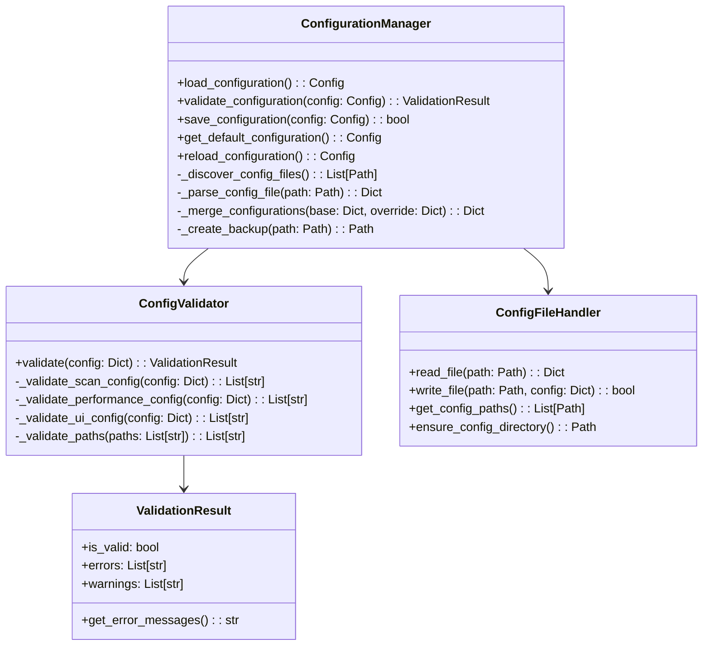
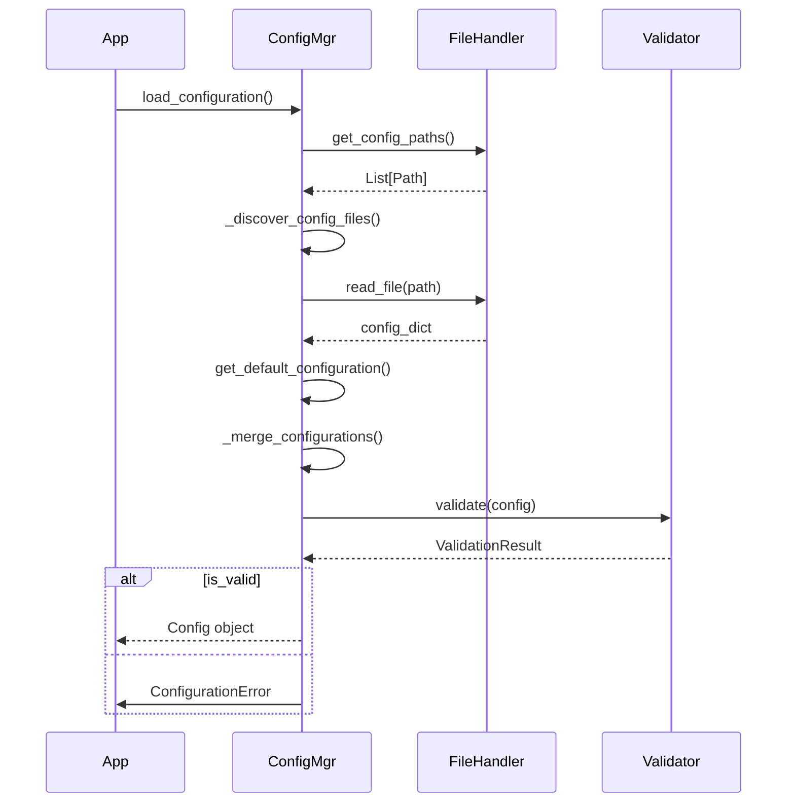
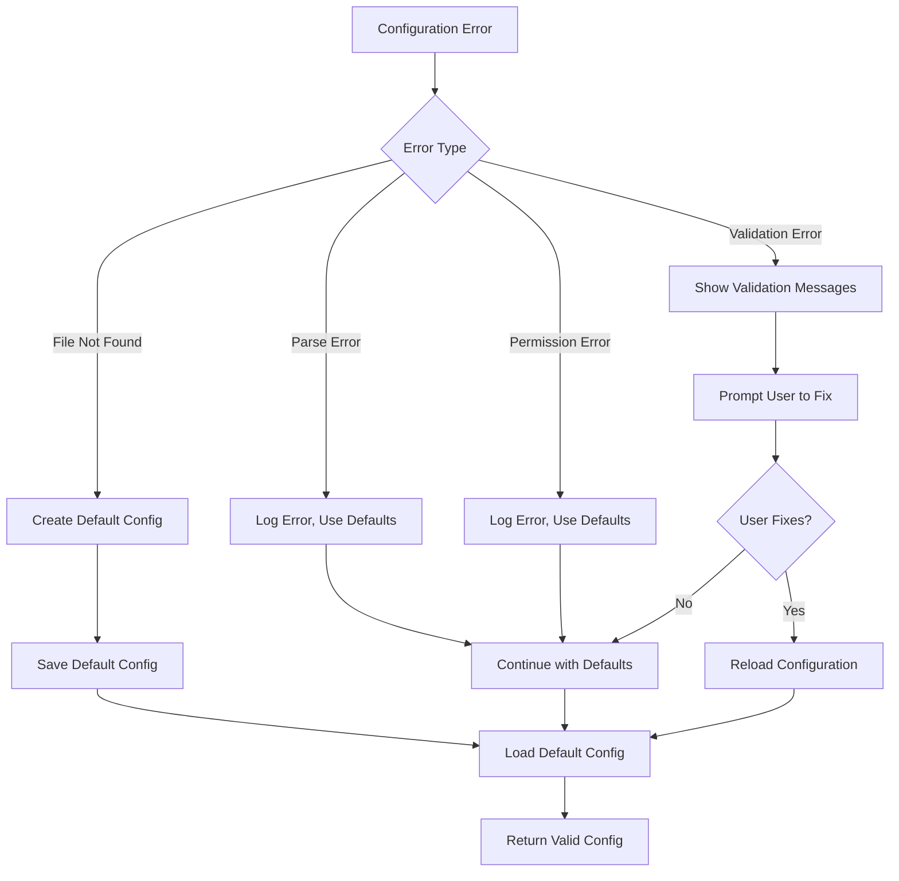

# Configuration Manager Design

## Class Diagram



## Sequence Diagram - Configuration Loading



## Data Structures

### Configuration Schema
```python
@dataclass
class ScanConfig:
    paths: List[str]
    exclude_patterns: List[str]
    max_depth: int = 10
    follow_symlinks: bool = False

@dataclass
class PerformanceConfig:
    mode: Literal["background", "foreground"] = "background"
    max_threads: int = 4
    memory_limit_mb: int = 1024
    cpu_limit_percent: int = 80
    io_throttling: bool = True

@dataclass
class ClassificationConfig:
    temp_file_age_days: int = 30
    large_file_threshold_mb: int = 500
    dev_folder_min_size_mb: int = 50
    exclude_extensions: List[str] = field(default_factory=list)

@dataclass
class UIConfig:
    theme: Literal["auto", "dark", "light"] = "auto"
    show_progress: bool = True
    verbose_logging: bool = False
    color_output: bool = True

@dataclass
class Config:
    scan: ScanConfig
    performance: PerformanceConfig
    classification: ClassificationConfig
    ui: UIConfig
```

## Key Design Decisions

### 1. Configuration File Discovery Strategy
**Decision**: Search multiple locations in order of precedence
- User-specific config (`%APPDATA%\disk_cleaner\`)
- Project directory
- System-wide config (future feature)

**Rationale**: Allows user customization while providing project defaults

### 2. Configuration Format Choice
**Decision**: Support both YAML and JSON with YAML as preferred format
**Rationale**:
- YAML: More human-readable, supports comments
- JSON: Machine-friendly, faster parsing
- Allows user preference while maintaining compatibility

### 3. Validation Strategy
**Decision**: Schema validation with domain-specific rules
**Rationale**:
- Catches configuration errors early
- Provides clear error messages
- Prevents runtime failures due to invalid config

### 4. Configuration Merging
**Decision**: Deep merge with override precedence
**Rationale**:
- Allows partial configuration files
- Maintains flexibility for different deployment scenarios
- Preserves default values for unspecified options

## Error Handling Design



## Configuration File Format Examples

### YAML Format (Preferred)
```yaml
# Disk Cleaner Configuration
scan:
  paths:
    - "C:\\Users\\%USERNAME%\\Documents"
    - "C:\\Users\\%USERNAME%\\Downloads"
  exclude_patterns:
    - "**/node_modules/**"
    - "**/.git/**"
  max_depth: 10
  follow_symlinks: false

performance:
  mode: "background"
  max_threads: 4
  memory_limit_mb: 1024
  cpu_limit_percent: 80
  io_throttling: true

classification:
  temp_file_age_days: 30
  large_file_threshold_mb: 500
  dev_folder_min_size_mb: 50
  exclude_extensions:
    - ".tmp"
    - ".bak"

ui:
  theme: "auto"
  show_progress: true
  verbose_logging: false
  color_output: true
```

### JSON Format (Alternative)
```json
{
  "scan": {
    "paths": ["C:\\Users\\%USERNAME%\\Documents"],
    "exclude_patterns": ["**/node_modules/**"],
    "max_depth": 10,
    "follow_symlinks": false
  },
  "performance": {
    "mode": "background",
    "max_threads": 4,
    "memory_limit_mb": 1024,
    "cpu_limit_percent": 80,
    "io_throttling": true
  },
  "classification": {
    "temp_file_age_days": 30,
    "large_file_threshold_mb": 500,
    "dev_folder_min_size_mb": 50,
    "exclude_extensions": [".tmp", ".bak"]
  },
  "ui": {
    "theme": "auto",
    "show_progress": true,
    "verbose_logging": false,
    "color_output": true
  }
}
```

## Performance Considerations
- **Caching**: Cache parsed configuration to avoid repeated file I/O
- **Lazy Loading**: Load configuration only when needed
- **Validation Optimization**: Use compiled schemas for faster validation
- **Memory Efficiency**: Use dataclasses for memory-efficient configuration objects

## Security Considerations
- **Path Validation**: Prevent directory traversal attacks
- **Permission Checks**: Validate file access permissions before operations
- **Input Sanitization**: Sanitize all configuration values
- **No Code Execution**: Prevent configuration files from executing arbitrary code
