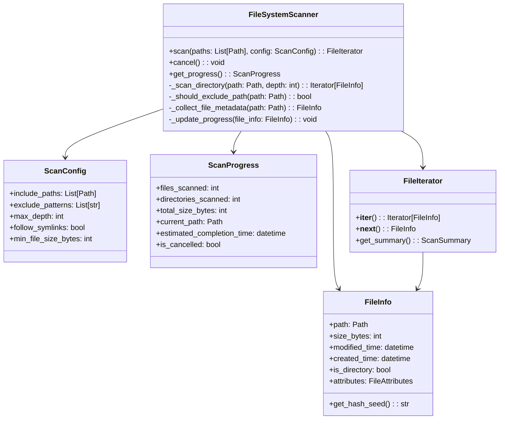
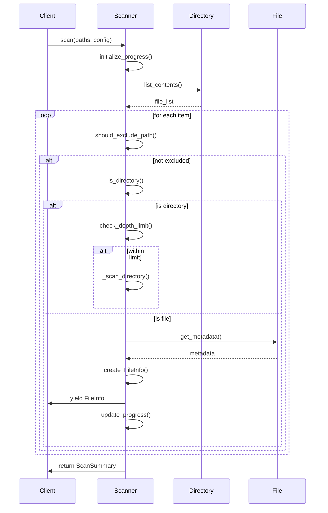
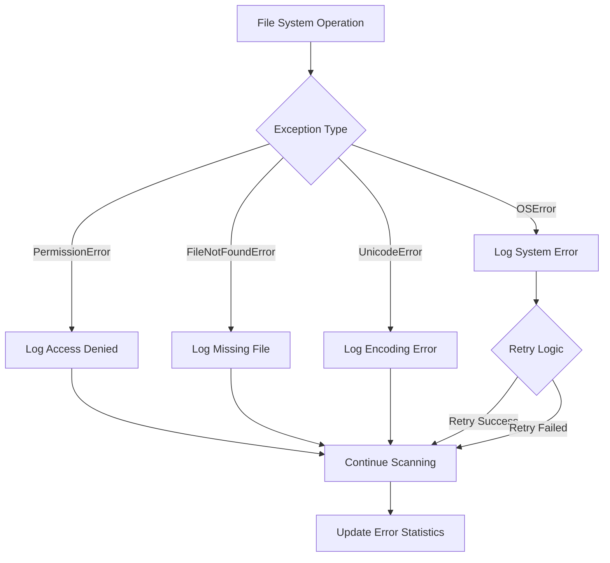

# File System Scanner Design

## Class Diagram



## Sequence Diagram - File Scanning



## Key Design Decisions

### 1. Iterator Pattern for Memory Efficiency
**Decision**: Use iterator pattern to stream file information rather than loading all files into memory
**Rationale**:
- Handles large file systems without excessive memory usage
- Allows processing to begin before scanning is complete
- Supports cancellation and progress monitoring

### 2. Exclusion Strategy
**Decision**: Apply exclusions at multiple levels (path, size, type)
**Rationale**:
- Early filtering reduces unnecessary I/O operations
- Multiple exclusion methods provide flexibility
- Performance optimization by avoiding expensive operations on excluded items

### 3. Progress Tracking Design
**Decision**: Event-driven progress updates with estimation
**Rationale**:
- Real-time user feedback during long operations
- Early termination capability
- Performance monitoring and optimization

### 4. Error Handling Strategy
**Decision**: Continue scanning on individual errors with detailed logging
**Rationale**:
- Robust operation on diverse file systems
- Complete scanning even with problematic files/directories
- Comprehensive error reporting for troubleshooting

## Data Structures

### FileInfo Class
```python
@dataclass
class FileInfo:
    path: Path
    size_bytes: int
    modified_time: datetime
    created_time: datetime
    is_directory: bool
    attributes: FileAttributes
    hash_seed: str  # For duplicate detection optimization

    def is_large_file(self, threshold_mb: int = 100) -> bool:
        return self.size_bytes > threshold_mb * 1024 * 1024

    def get_age_days(self) -> int:
        return (datetime.now() - self.modified_time).days
```

### ScanConfig Class
```python
@dataclass
class ScanConfig:
    include_paths: List[Path]
    exclude_patterns: List[str] = field(default_factory=list)
    max_depth: int = 10
    follow_symlinks: bool = False
    min_file_size_bytes: int = 1024  # 1KB minimum
    exclude_system_files: bool = True
    exclude_hidden_files: bool = False
```

### ScanProgress Class
```python
@dataclass
class ScanProgress:
    files_scanned: int = 0
    directories_scanned: int = 0
    total_size_bytes: int = 0
    current_path: Optional[Path] = None
    start_time: datetime = field(default_factory=datetime.now)
    is_cancelled: bool = False

    @property
    def scan_rate_files_per_second(self) -> float:
        elapsed = (datetime.now() - self.start_time).total_seconds()
        return self.files_scanned / elapsed if elapsed > 0 else 0

    @property
    def estimated_completion_time(self) -> Optional[datetime]:
        if self.scan_rate_files_per_second == 0:
            return None
        # Estimation logic here
        pass
```

## Performance Optimization Strategies

### 1. Directory Reading Optimization
```python
# Use scandir for better performance than os.listdir
def _list_directory_contents(self, path: Path) -> Iterator[Path]:
    try:
        with os.scandir(path) as entries:
            for entry in entries:
                yield Path(entry.path)
    except (OSError, PermissionError):
        # Log error and continue
        self._logger.warning(f"Cannot access directory: {path}")
        return
```

### 2. File Metadata Batching
```python
def _collect_file_batch_metadata(self, file_paths: List[Path]) -> List[FileInfo]:
    """Collect metadata for multiple files in batch for efficiency"""
    file_infos = []
    for path in file_paths:
        try:
            stat = path.stat()
            file_info = FileInfo(
                path=path,
                size_bytes=stat.st_size,
                modified_time=datetime.fromtimestamp(stat.st_mtime),
                created_time=datetime.fromtimestamp(stat.st_ctime),
                is_directory=path.is_dir(),
                attributes=FileAttributes.from_stat(stat),
                hash_seed=self._calculate_hash_seed(path, stat)
            )
            file_infos.append(file_info)
        except (OSError, PermissionError):
            # Log error and continue
            continue
    return file_infos
```

### 3. Memory Management
- **Streaming Processing**: Process files in batches of 1000
- **Weak References**: Use weak references for progress callbacks
- **Resource Cleanup**: Explicit cleanup of file handles and iterators

## Error Handling Patterns



## Testing Strategy

### Unit Testing
- **Mock File System**: Use `tmp_path` and `monkeypatch` for file operations
- **Edge Cases**: Test with various file types, permissions, encodings
- **Performance**: Test scanning speed and memory usage
- **Cancellation**: Test graceful cancellation of operations

### Integration Testing
- **Real File Systems**: Test on various directory structures
- **Large Datasets**: Test with thousands of files
- **Permission Scenarios**: Test with restricted access directories
- **Progress Monitoring**: Verify progress updates and estimation accuracy

## Security Considerations
- **Path Traversal Prevention**: Validate and normalize all paths
- **Permission Validation**: Check access permissions before operations
- **Resource Limits**: Prevent resource exhaustion attacks
- **Input Sanitization**: Sanitize all file paths and patterns
