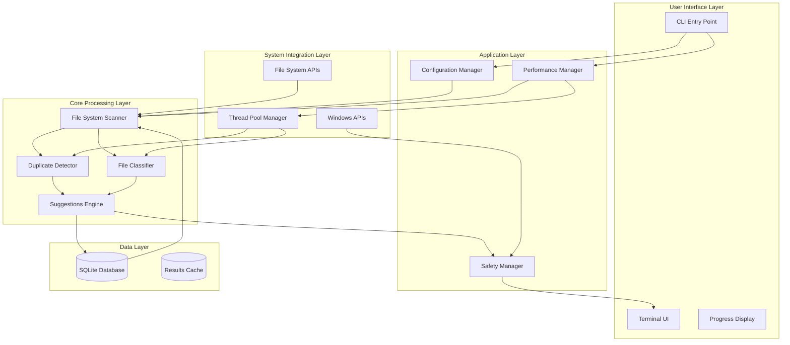
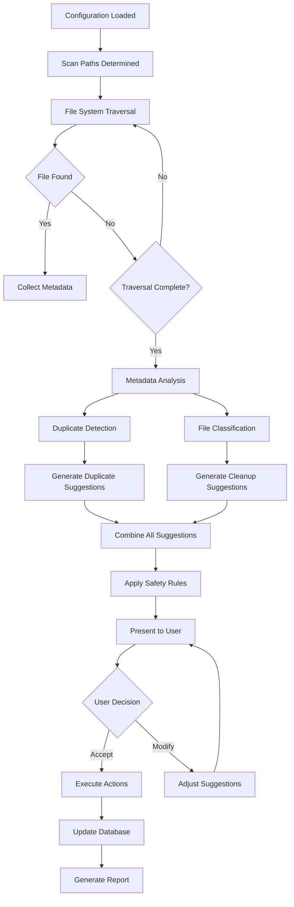
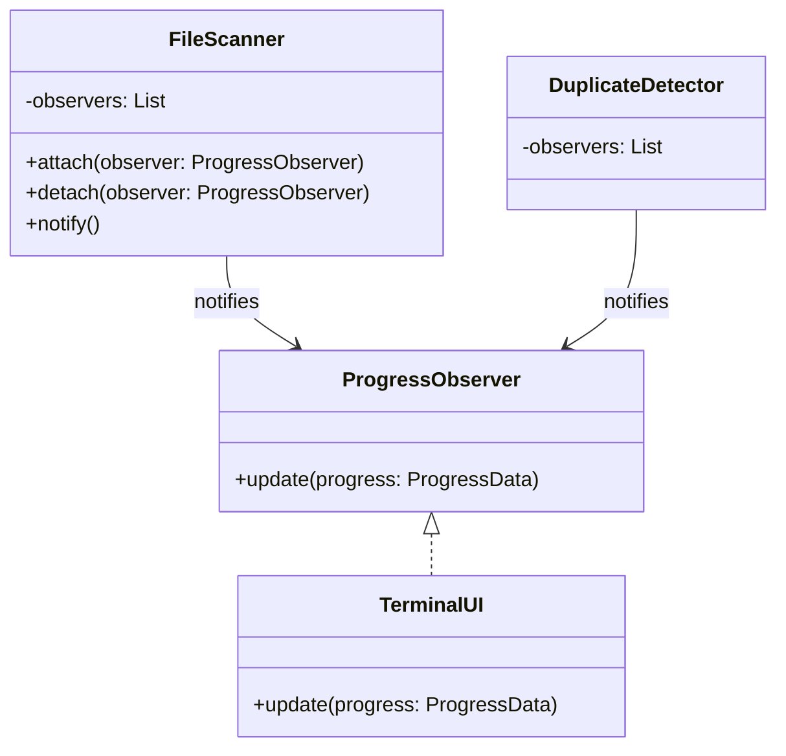
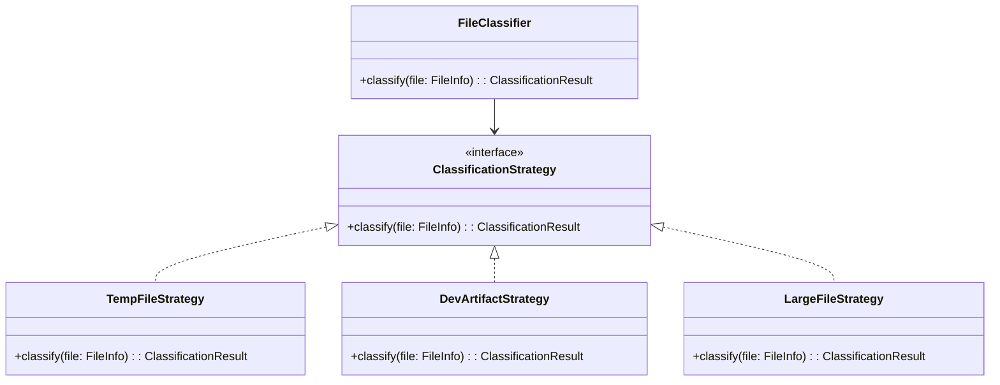
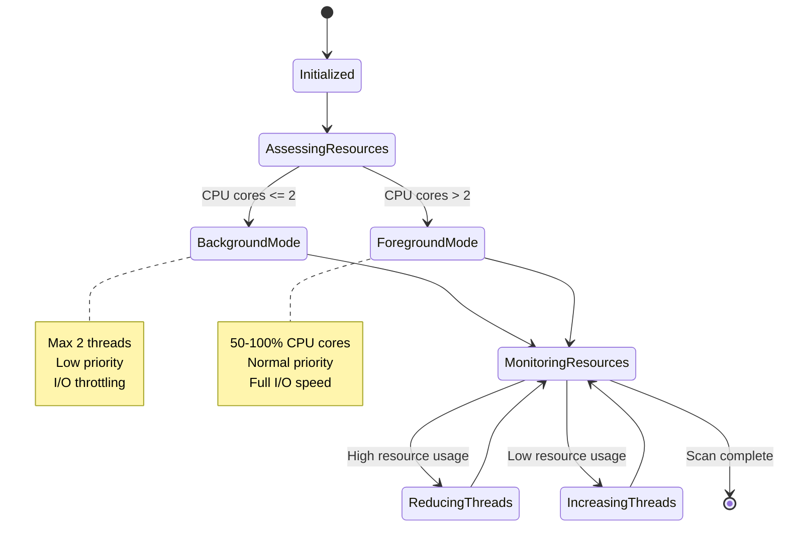
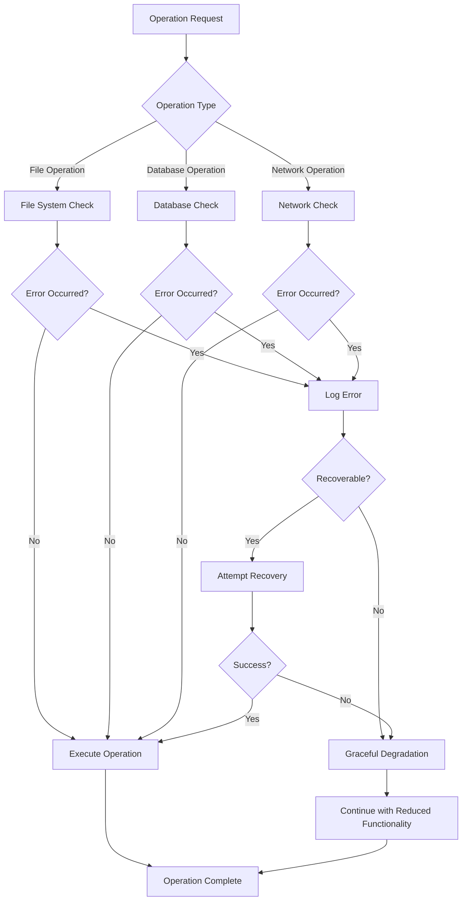
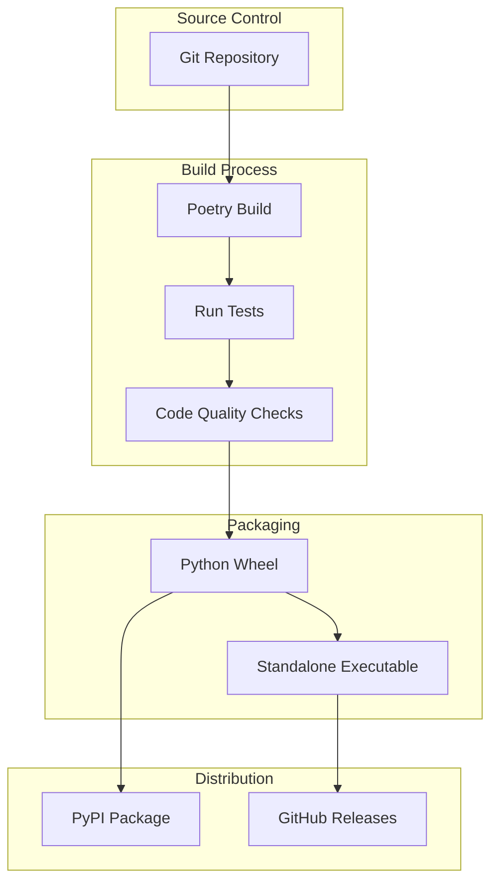

# System Architecture & Design

## High-Level System Architecture



## Data Flow Architecture



## Component Interaction Patterns

### Observer Pattern for Progress Updates


### Strategy Pattern for File Classification


## Database Schema Design

```mermaid
erDiagram
    SCAN_SESSIONS {
        id INTEGER PK
        timestamp DATETIME
        scan_path TEXT
        total_files INTEGER
        total_size_bytes INTEGER
        duration_seconds REAL
        status TEXT
    }

    FILES {
        id INTEGER PK
        scan_session_id INTEGER FK
        file_path TEXT
        file_size_bytes INTEGER
        modified_time DATETIME
        file_hash TEXT
        classification TEXT
        suggested_action TEXT
        action_taken TEXT
    }

    DUPLICATE_GROUPS {
        id INTEGER PK
        group_hash TEXT
        file_count INTEGER
        total_size_bytes INTEGER
        recommended_keep_file_id INTEGER FK
    }

    DUPLICATE_GROUP_FILES {
        duplicate_group_id INTEGER FK
        file_id INTEGER FK
        PK(duplicate_group_id, file_id)
    }

    SUGGESTIONS {
        id INTEGER PK
        file_id INTEGER FK
        suggestion_type TEXT
        description TEXT
        potential_savings_bytes INTEGER
        confidence_score REAL
    }

    SCAN_SESSIONS ||--o{ FILES : contains
    SCAN_SESSIONS ||--o{ DUPLICATE_GROUPS : generates
    FILES ||--o{ DUPLICATE_GROUP_FILES : belongs_to
    DUPLICATE_GROUPS ||--o{ DUPLICATE_GROUP_FILES : contains
    FILES ||--o{ SUGGESTIONS : has
    DUPLICATE_GROUPS }o--|| FILES : recommends_keeping
```

## Thread Pool Management Design



## Error Handling Architecture



## Security Considerations

### Data Protection
- **No External Network Access**: All operations are local to the system
- **File Content Isolation**: File hashes only, never stores actual file contents
- **Configuration Security**: Sensitive paths excluded from logs and reports
- **Temporary File Cleanup**: Automatic cleanup of temporary files and caches

### Access Control
- **File System Permissions**: Respect Windows file system permissions
- **User Context**: Operations run in user context, no privilege escalation
- **Audit Trail**: All operations logged with timestamps and file paths

### Error Handling Security
- **Information Disclosure**: Error messages don't expose sensitive file paths
- **Resource Exhaustion**: Limits on memory usage and thread counts
- **Input Validation**: All file paths and configuration values validated

## Performance Characteristics

### Expected Performance Metrics
- **File Discovery**: ~10,000 files/second on SSD
- **Hash Calculation**: ~50MB/second (MD5), ~25MB/second (SHA256)
- **Memory Usage**: <1GB for typical scans (<500K files)
- **Database Operations**: <100ms per 1K file operations
- **UI Responsiveness**: Progress updates every 100ms

### Scalability Considerations
- **Large File Systems**: Incremental scanning with database caching
- **Memory Constraints**: Streaming processing for very large file sets
- **CPU Optimization**: Parallel processing with thread pool optimization
- **I/O Optimization**: Asynchronous I/O for better disk utilization

## Deployment Architecture


